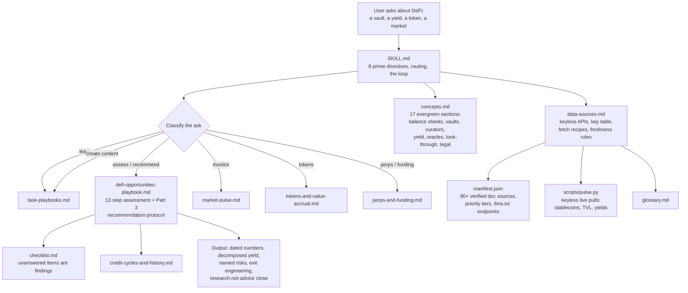

# defi-native

A skill that makes your AI crypto-native. Give it an understanding of capital markets. Use it to assess any vault or yield down to its lowest layer, decompose any APY into what you would actually earn, monitor what changed this week, write accurate DeFi content, and learn key financial concepts.

Works with Claude Code, Cursor, Codex, and any agent that reads the [Agent Skills](https://agentskills.io) format. MIT licensed.

Built by [@emilylai](https://x.com/emilylai) as a way to deepen my own capital markets and market microstructure understanding, as crypto increasingly becomes finance on new rails.

## What it does

This skill gives your agent two things:

1. **Evergreen mental models**: foundational capital markets and market microstructure understanding (a full TradFi Rosetta stone), what vaults and curators actually are, how to decompose any yield along four axes and four realization filters, six lending market architectures, stablecoin taxonomy by claim, RWA wrappers and tokenized equities, the take-rate map, oracle classes, AMM/LP mechanics and MEV, look-through to the lowest layer, and the recurring failure shapes with real incident prints.
2. **Live-data direction and discipline**: the skill points the agent at the right source for each question (vaults.fyi, DefiLlama, Morpho's free GraphQL, rwa.xyz, Merkl, protocol APIs, and 90+ verified protocol docs via llms.txt and .md endpoints) and forces fresh pulls before any numeric claim, with as-of dates on every number.

The one-line competence test: shown a "7% USDC vault," an agent with this skill names the five layers, looks through to the real collateral, names the oracle class, splits base from incentives, points at first loss, and says whether liquidations can fire on the tape humans see.

## What it was built from

A months-long private research corpus, distilled and then verified: primary protocol documentation across 90+ sources, incident postmortems studied at the mechanism level (the Stream, Resolv, PT-reUSD, Term Finance, and Kelp prints all live in the failure catalog), the vaults.fyi curation census, issuer prospectuses read in full (including the tokenized-stock structures), academic work on tokenized Treasuries, and TradFi market-structure fundamentals. Before release, every load-bearing claim was re-verified against live primary sources, the skill was audited adversarially by a panel of independent models, and it was eval-gated: paired runs with and without the skill, graded on structure, not memorized numbers. Dated figures inside are calibration examples; the skill re-verifies at use time by design.

## How it works



Progressive disclosure: only the description is always loaded. SKILL.md loads when a DeFi question fires it; references load only when the task routes there; the manifest is an address book the agent fetches 4 to 6 rows from, never whole.

## Use cases

Learning:
- "What is a vault and where does this 9% come from?"
- "Explain synthetic dollars like I know TradFi but not crypto"
- "How do liquidations actually work on Morpho?"

Due diligence and opportunity:
- "Assess this vault's risk and opportunity makeup [link]"
- "Is this 12% APY sustainable?"
- "Base just launched tokenized stocks, what are the best opportunities? I have $5,000"
- "Compare sUSDe vs sUSDS for parking $10k"
- "Why did that vault depeg yesterday?"

Content and marketing:
- "Write an accurate X thread about our new USDC vault paying 8.2%"
- "Draft the honest comparison table for our product page"

Monitoring:
- "What changed in DeFi this week?"
- "Set up a watch plan for my positions"
- "Scan for rate dislocations"

Full worked outputs: [examples/assessment-example.md](examples/assessment-example.md) (the minimum-bar skeleton, fictional product) and [evals/sample-output-2026-08-28.md](evals/sample-output-2026-08-28.md) (a full real run under the recommendation protocol).

## Structure

| File | What it is |
|---|---|
| [SKILL.md](SKILL.md) | The brain: 8 prime directives, routing, and the working loop |
| [analogs.md](references/analogs.md) | The TradFi Rosetta stone: every onchain object mapped to its ancestor, plus the baseline chapters (money hierarchy, duration, settlement, claim types) |
| [concepts.md](references/concepts.md) | The evergreen foundation: 17 sections from balance sheets to oracle classes to legal classification |
| [defi-opportunities-playbook.md](references/defi-opportunities-playbook.md) | The flagship workflow: 12-step assessment, opportunity lens, recommendation protocol |
| [data-sources.md](references/data-sources.md) | Where to get live data: keyless APIs, fallbacks, and the bring-your-own-keys table |
| [checklist.md](references/checklist.md) | The full pre-verdict checklist; unanswered items are findings |
| [task-playbooks.md](references/task-playbooks.md) | How to teach the space and how to write accurate DeFi content |
| [market-pulse.md](references/market-pulse.md) | The monitoring discipline: weekly pulse, leading indicators, structural signals |
| [tokens-and-value-accrual.md](references/tokens-and-value-accrual.md) | Is this token worth anything: rights, accrual mechanisms, launch supply mechanics |
| [perps-and-funding.md](references/perps-and-funding.md) | Perpetual futures, funding rates, basis strategies, venue due diligence |
| [credit-cycles-and-history.md](references/credit-cycles-and-history.md) | Cycle classification and the historical rhyme table |
| [glossary.md](references/glossary.md) | The vocabulary, one line each |
| [pulse.py](scripts/pulse.py) | A small script for keyless live data pulls: stablecoin float, TVL, yields |
| [manifest.json](manifest.json) | The address book: 90+ verified doc sources with priority tiers |
| [evals/](evals/) | Test cases plus a full real sample output |
| [examples/](examples/) | Worked examples, including a failure autopsy |

## Install

**Easiest: ask your agent to do it.** If you use Claude Code (or another coding agent), paste this into it and it will install the skill for you:

> Install the skill from github.com/emlai/defi-native-skill by running: npx skills add emlai/defi-native-skill

**Or run one command yourself.** This goes in your computer's terminal, not in a chat window:

1. Open the terminal. Mac: press Cmd+Space, type "Terminal", press Enter. Windows: open "PowerShell" from the Start menu.
2. Paste this and press Enter:

```
npx skills add emlai/defi-native-skill
```

3. Answer the prompts (it detects your agent and asks where to install; the defaults are fine).
4. Start a new session in your agent. The skill triggers automatically on DeFi questions.

If step 2 says `command not found: npx`, install Node.js first from [nodejs.org](https://nodejs.org) (the LTS download), then repeat step 2. The [skills CLI](https://github.com/vercel-labs/skills) works for Claude Code, Cursor, Codex, and other Agent Skills hosts.

**Updating:** installed skills do not update themselves, but this one checks: during monitoring tasks it compares its version against this repo and tells you when an update exists. To update, run `npx skills update` (or `git pull` in the cloned folder).

**Manual (for developers):**

```
git clone https://github.com/emlai/defi-native-skill.git
ln -s "$(pwd)/defi-native-skill" ~/.claude/skills/defi-native
```

Other Agent Skills hosts: same folder into that host's skills directory (`.agents/skills/` for the cross-agent standard).

**Optional keys** for deeper data (none required): see the bring-your-own-keys table in `references/data-sources.md`. Everything core works keyless.

## Principles

- A number without a date is a rumor.
- An APY you have not decomposed is marketing, not information.
- Vault names describe marketing; only composition describes risk.
- Look through to the lowest layer: the stack ends at a real cash flow or a named counterparty, not a product label.
- Recommendations only with the full view: decomposed risk, the opportunity case, labeled-basis probabilities, risk:reward including the total-loss branch, invalidation triggers, and a runner-up.
- Read-only, always. The skill never signs, submits, or approves anything.
- Every strong opinion in this industry is someone's book talking.

## Contributing

Issues and pull requests welcome. Read [CONTRIBUTING.md](CONTRIBUTING.md) first: the conventions are strict (dated numbers, no em dashes, decomposition discipline) and PRs that add undated figures or recommendations without the full view will be asked to revise. The highest-value contributions: new verified manifest sources with llms.txt endpoints, postmortem-sourced failure shapes, corrections with primary sources, and eval cases that catch a real failure.

## License

MIT. See [LICENSE](LICENSE). This skill produces research, not financial advice; DeFi carries total-loss tails, and the skill says so in every assessment.
